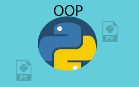

# OOP---Python-Resources
Some of my favorite resources for learning OOP

## DataCamp Course:
[Object-Oriented Programming in Python](https://app.datacamp.com/learn/courses/object-oriented-programming-in-python)

## YouTube Tutorials:
* Arabic learners: 

* Another [Good Series of Videos in English](https://www.youtube.com/playlist?list=PL-osiE80TeTsqhIuOqKhwlXsIBIdSeYtc)

## For Readers:
People tend to learn differently, some prefer to watch a video while others prefer reading through textual content. For those who prefer reading, you can find this tutorial helpful:

1. [Python Class](https://www.tutorialsteacher.com/python/python-class)
2. [Inheritance in Python](https://www.tutorialsteacher.com/python/inheritance-in-python)
3. [Python Access Modifiers](https://www.tutorialsteacher.com/python/public-private-protected-modifiers)
4. [Decorators in Python](https://www.tutorialsteacher.com/python/decorators)
5. [Python - Magic or Dunder Methods](https://www.tutorialsteacher.com/python/magic-methods-in-python)
